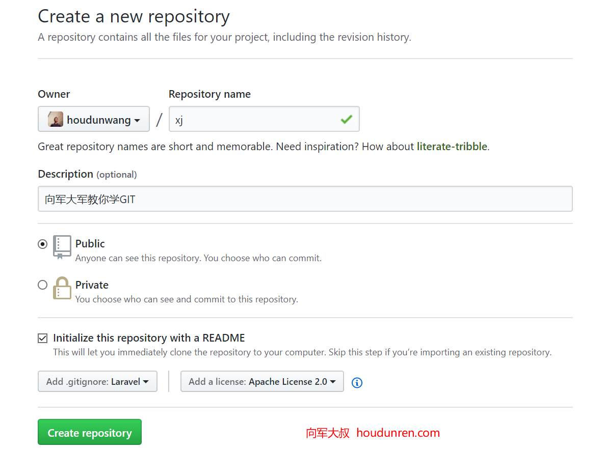
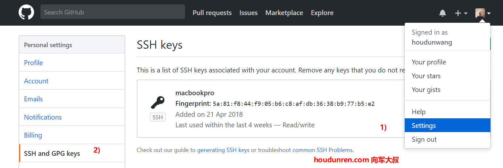
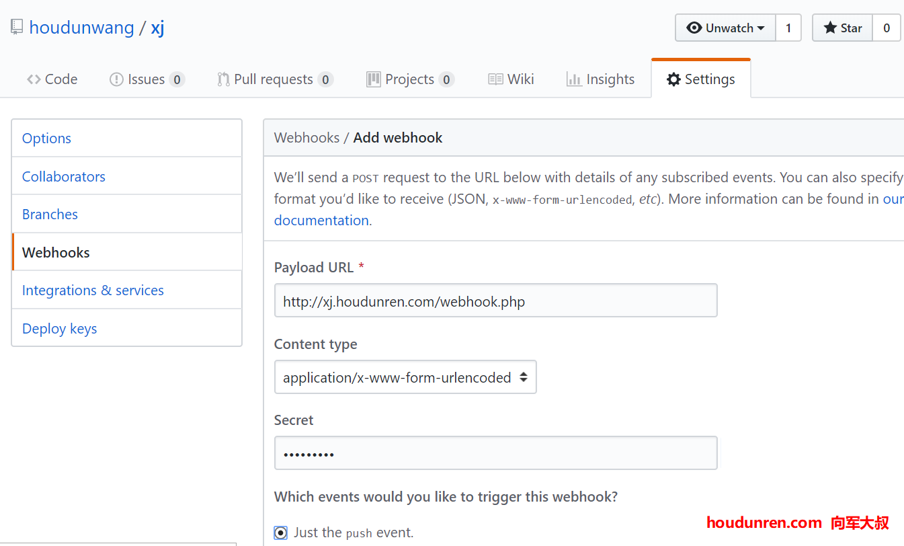

## Git


> 后盾人 www.houdunren.com  作者：[向军大叔](http://www.aoxiangjun.com)

#### 安装

自诞生于 2005 年以来，Git 日臻成熟完善，在高度易用的同时，仍然保留着初期设定的目标。它的速度飞快，极其适合管理大项目 。

Git可以在windows、Mac、Linux全平台系统使用。登录  https://git-scm.com/downloads 下载你系统的Git软件并进行安装。

> windows 用户我更建议安装  git for windows ，下载地址：  https://gitforwindows.org/
>
> 包信 Git Base 、Git Gui 

安装后通过以下命令查看，如果显示版本号那就是安装成功了

```
git --version
```

Gui

Gui指Git的图形界面管理软件，https://git-scm.com/downloads/guis 这个网址列出了多个可供基本上所有平台使用的Gui软件。如果要使用Gui而非命令行操作，我推荐 `sourcetree` 这也是我多年使用的软件，功能强大、跨平台、免费。

#### 配置

配置文件为 `~/.gitconfig` ，执行任何Git配置命令后文件将自动创建。

第一个要配置的是你个人的用户名称和电子邮件地址。这两条配置很重要，每次 Git 提交时都会引用这两条信息，说明是谁提交了更新，所以会随更新内容一起被永久纳入历史记录： 

```
git config --global user.email "2300071698@qq.com"
git config --global user.name "2300071698@qq.com"
```

#### 常用

1. 初始化新仓库 `git init` 
2. 克隆旧仓库 `git clone https://github.com/houdunwang/arr.git`
3. 查看状态 `git status`
4. 提交单个文件 `git add index.php`
5. 提交所有文件 `git add -A`
6. 使用通配符提交 `git add *.js`
7. 提交到仓库中 `git commit -m '提示信息'`
8. 提交已经跟踪过的文件，不需要执行add `git commit -a -m '提交信息'`
9. 删除版本库与项目目录中的文件 `git rm index.php`
10. 只删除版本库中文件但保存项目目录中文件 `git rm --cached index.php`
11. 修改最后一次提交 `git commit --amend`

#### 清理

1. 放弃没有提交的修改 `git checkout .`
2. 删除没有add 的文件和目录 `git clean -fd`
3. 显示将要删除的文件或目录 `git clean -n`

#### Log

1. 查看日志 `git log`
2. 查看最近2次提交日志并显示文件差异 `git log -p -2`
3. 显示已修改的文件清单  `git log --name-only`
4. 显示新增、修改、删除的文件清单  `git log --name-status`
5. 一行显示并只显示SHA-1的前几个字符 `git log --oneline `

#### Alias

通过创建命令别名可以减少命令输入量。

```
git config --global alias.c commit
```

> 可以在配置文件  ~/.gitconfig 中查看或直接编辑

下面是一个Git命令Alias配置

```
[alias]
	a = add .
	c = commit
	s = status
	l = log
	b = branch
```

现在可以使用 ` git a` 实现  `git add .` 一样的效果了。

**系统Alias**

在 `~/.bash_profile` 文件中定义

```
alias gs="git status"
alias gc="git commit -m "
alias gl="git log --graph --pretty=format:'%Cred%h%Creset -%C(yellow)%d%Creset %s %Cgreen(%cr) %C(bold blue)<%an>%Creset' --abbrev-commit  "
alias gb="git branch"
alias ga="git add ."
alias go="git checkout"
```

命令行直接使用 `gs` 即可以实现 `git status` 一样的效果了。

> window 系统需要使用 git for window 中的 `Git Base` 软件

#### .gitignore

.gitignore用于定义忽略提交的文件

- 所有空行或者以注释符号 `＃` 开头的行都会被 Git 忽略。
- 匹配模式最后跟反斜杠（`/`）说明要忽略的是目录。
- 可以使用标准的 glob 模式匹配。

```

.idea
/vendor
.env
/node_modules
/public/storage
*.txt
```

#### Branch

分支用于为项目增加新功能或修复Bug时使用。

1. 创建分支 `git branch dev`

2. 查看分支 `git branch`

3. 切换分支 `git checkout dev`

4. 创建并切换分支 `git checkout -b feature/bbs`

5. 合并dev分支到master

   ```
   git checkout master
   git merge dev
   ```

6. 删除分支 `git branch -d dev`

7. 删除没有合并的分支`git branch -D dev`

8. 删除远程分支 `git push origin :dev`

9. 查看未合并的分支(切换到master) ` git branch --no-merged`

10. 查看已经合并的分支(切换到master) `git branch --merged`

#### 冲突

不同分修改同一个文件或不同开发者修改同一个分支文件都可能造成冲突，造成无法提交代码。

1. 使用编辑器修改冲突的文件
2. 添加暂存 `git add .`  表示已经解决冲突
3. git commit 提交完成

#### 储藏（Stashing）

当你正在进行项目中某一部分的工作，里面的东西处于一个比较杂乱的状态，而你想转到其他分支上进行一些工作。问题是，你不想提交进行了一半的工作，否则以后你无法回到这个工作点。 

"暂存" 可以获取你工作目录的中间状态——也就是你修改过的被追踪的文件和暂存的变更——并将它保存到一个未完结变更的堆栈中，随时可以重新应用。 

1. 储藏工作 `git stash`
2. 查看储藏列表 `git stash list`
3. 应用最近的储藏 `git stash apply `
4. 应用更早的储藏 `git stash apply stash@{2} `
5. 删除储藏`git stash drop stash@{0}`
6. 应用并删除储藏 `git stash pop`

#### Tag

Git 也可以对某一时间点上的版本打上标签 ，用于发布软件版本如 v1.0

1. 添加标签 `git tag v1.0`
2. 列出标签 `git tag`
3. 推送标签 `git push --tags`
4. 删除标签 `git tag -d v1.0.1`
5. 删除远程标签 `git push origin :v1.0.1  `

#### 发布

对mster分支代码生成压缩包供使用者下载使用，`--prefix` 指定目录名

```
git archive master --prefix='hdcms/' --format=zip > hdcms.zip
```

#远程仓库

下面是最热的`Github`进行讲解，使用`码云、codeing` 等国内仓库使用方式一致，就不在赘述了。

**创建仓库**

为了完成以下示例，你需要在`GitHub` 创建好仓库。




#### SSH

**生成秘钥**

使用ssh连接Github发送指令更加安全可靠，也可以免掉每次输入密码的困扰。

在命令行中输入以下代码（windows用户使用 Git Bash）

```
ssh-keygen -t rsa
```

一直按回车键直到结束。系统会在`~/.ssh` 目录中生成  `id_rsa`和`id_rsa.pub`，即密钥`id_rsa`和公钥`id_rsa.pub`。

**向GitHub添加秘钥**



点击 `New SSH key` 按钮，添加上面生成的 `id_rsa.pub` 公钥内容。

#### 关联远程

1. 创建本地库并完成初始提交 

   ```
   echo "# hd-xj" >> README.md
   git init
   git add README.md
   git commit -m "first commit"
   ```

2. 添加远程仓库 

   ```
   git remote add origin git@github.com:houdunwang/hd-xj.git
   ```

3. 查看远程库

    ```
     git remote -v
    ```

4. 推送数据到远程仓库

    ```
    git push -u origin master
    ```

5. 删除远程仓库关联

    ```
    git remote rm origin
    ```

> 通过 clone 克隆的仓库，本地与远程已经自动关联，上面几步都可以省略。

#### pull

拉取远程主机某个分支的更新，再与本地的指定分支合并。

1. 拉取origin主机的ask分支与本地的master分支合并 `git pull origin ask:ask`
2. 拉取origin主机的ask分支与当前分支合并 `git pull origin ask`
3. 如果远程分支与当前本地分支同名直接执行 `git pull`

#### push

`git push`命令用于将本地分支的更新，推送到远程主机。它的格式与`git pull`命令相似。

1. 将当前分支推送到`origin`主机的对应分支(如果当前分支只有一个追踪分支 ，可省略主机名)

   ```
   git push origin
   ```

2. 使用`-u`选项指定一个默认主机 ,这样以后就可以不加任何参数直播使用`git push`。 

   ```
   $ git push -u origin master
   ```

3. 删除远程`ask`分支 `git push origin --delete ask`

4. 本地ask分支关联远程分支并推送 `git push --set-upstream origin ask`

#### 提交多个库

我可以将代码提交到多个远程版本库中，比如后盾人的 [课程代码](https://gitee.com/houdunren/code) 就提交到了Github与Gitee两个库中。

```
# 增加一个远程库
git remote add github git@github.com:houdunwang/coding.git

# 提交到远程库
git push github
```

也可以创建命令一次提交到两个库(注：参考上面的命令设置章节)

```
alias gp="git push & git push github"
```


## 自动部署

GitHub设置 `WebHook`



#### PHP

项目中添加处理 webhook 的webhook.php文件内容如下，并提交到版本库。

```
<?php
// GitHub Webhook Secret.
// GitHub项目 Settings/Webhooks 中的 Secret
$secret = "houdunren";

// Path to your respostory on your server.
// e.g. "/var/www/respostory"
// 项目地址
$path = "/www/wwwroot/xj.houdunren.com";

// Headers deliveried from GitHub
$signature = $_SERVER['HTTP_X_HUB_SIGNATURE'];

if ($signature) {
  $hash = "sha1=".hash_hmac('sha1', file_get_contents("php://input"), $secret);
  if (strcmp($signature, $hash) == 0) {
    echo shell_exec("cd {$path} && /usr/bin/git reset --hard origin/master && /usr/bin/git clean -f && /usr/bin/git pull 2>&1");
    exit();
  }
}

http_response_code(404);
?>
```

**创建站点**

下面示例我使用的是 `宝塔` 主机面板。 

现在服务器上生成了站点目录 `/www/wwwroot/xj.houdunren.com` ，因为目录中存在 `.user.ini` 文件（定义站点可以访问的目录权限），造成不能 `clone` 代码，将目录随意改名。

**开启 `shell_exec` **

执行 `git pull` 指令需要使用 `shell_exec` 函数，删除shell_exec 禁用函数后重启PHP。


**clone**

登录服务器并使用 https 协议 clone 项目代码

```
ssh root@xj.houdunren.com -p 22
git clone https://github.com/houdunwang/xj.git xj.houdunren.com
```

**修改权限**

```
chown -R www .
chmod -R g+s .
sudo -u www git pull
```

现在向GitHub 推送代码后，服务器将自动执行代码拉取，自动部署功能设置完成了。

## GitHub

#### 接口

接口地址：https://api.github.com/

* 项目接口列表：https://api.github.com/repos/houdunwang/hdcms-laravel
* 获取文档内容：https://api.github.com/repos/houdunwang/hdcms-laravel/contents/config

