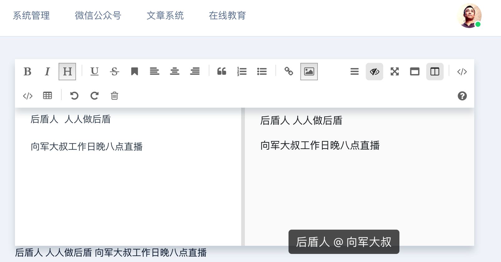

# 深入掌握Vue.js 中的Prop

> 向军大叔 @ [aoxiangjun.com](http://www.aoxiangjun.com)

prop是向了组件传递数据的机制，但很多同学对他不是很了解。向军大叔通过实例详细讲解一下正确的使用方法。

下面的代码是绑定数据的最简单方法

````
<input v-model="content"/>
````

他的原理是：

```
<input :value="content" @input="content = $event.target.value"/>
```

即当我们修改表单（表单可以理解为一个子组件）时，表单使用 

```
@change="$emit('input',$event)"
```

触发父级组件的input事件，并将表单实例传递给父级元素，父级元素通过 `$event` 获取子组件的`value` 值，并赋予父组件的 content 属性。

上面是对 v-model 指令的运行机制讲解，对这方面知识了解后，我们可以对自定义的组件使用 `v-model` 以达到父子组件数据模拟双向同步的结果。

## 实操

下面我们通过一个markdown编辑器插件，并使用上面的原理达到数据双向同步。

开发环境是大叔在 `laravel5.7` 框架中完成，因为laravel本身内置对vue.js的支持。

### 安装

```
cnpm install mavon-editor --save
```

### 编辑器组件

创建组件 `resource/js/components/MarkdownEditorComponent.vue` ，主要是定义编辑器插件。

其中声明的 prop value用于接收父组件数据，其他定义了 `@change="$emit('input',$event)"` 方法处罚父组件的 input 事件（这就是大叔带大家上面分析的业务）。

```
<template>
    <div>
        <mavon-editor ref="md" v-model="content" :toolbars="toolbars" @imgAdd="$imgAdd" @change="$emit('input',$event)"/>
    </div>
</template>
<script>
    import 'mavon-editor/dist/css/index.css';
    import {mavonEditor} from 'mavon-editor'
    export default {
        props: [
            'value'
        ],
        components: {
            mavonEditor
        },
        methods: {
            // 绑定@imgAdd event
            $imgAdd(pos, $file) {
                // 第一步.将图片上传到服务器.
                let formdata = new FormData();
                formdata.append('file', $file);
                axios({
                    url: 'http://hdcms.test/common/upload/upload',
                    method: 'post',
                    data: formdata,
                    headers: {'Content-Type': 'multipart/form-data'},
                }).then((url) => {
                    this.$refs.md.$img2Url(pos, url.data.file);
                })
            }
        },
        data() {
            return {
                content: this.value,
                toolbars: {
                    bold: true, // 粗体
                    italic: true, // 斜体
                    header: true, // 标题
                    underline: true, // 下划线
                    strikethrough: true, // 中划线
                    mark: true, // 标记
                    superscript: false, // 上角标
                    subscript: false, // 下角标
                    quote: true, // 引用
                    ol: true, // 有序列表
                    ul: true, // 无序列表
                    link: true, // 链接
                    imagelink: true, // 图片链接
                    code: true, // code
                    table: true, // 表格
                    fullscreen: true, // 全屏编辑
                    readmodel: true, // 沉浸式阅读
                    htmlcode: true, // 展示html源码
                    help: true, // 帮助
                    /* 1.3.5 */
                    undo: true, // 上一步
                    redo: true, // 下一步
                    trash: true, // 清空
                    save: false, // 保存（触发events中的save事件）
                    /* 1.4.2 */
                    navigation: true, // 导航目录
                    /* 2.1.8 */
                    alignleft: true, // 左对齐
                    aligncenter: true, // 居中
                    alignright: true, // 右对齐
                    /* 2.2.1 */
                    subfield: true, // 单双栏模式
                    preview: true, // 预览
                }
            }
        }
    }
</script>
```


在 `resources/js/app.js` 添加内容如下 

```
...
Vue.component('edit', require('./components/EditComponent.vue'));
...
```


### 使用编辑器

现在我们在父组件 `/components/EditComponent.vue` 中使用定义的编辑器组件

```
<template>
    <div class="container">
        <markdown-editor v-model="value"/>
        <!--观察数据同步-->
		<p>{{value}}</p>
    </div>
</template>

<script>
	#引入组件
    import MarkdownEditor from './MarkdownEditorComponent'
    export default {
        components:{
        	#引入组件
            'markdown-editor':MarkdownEditor
        },
        data(){
            return {
                value:'后盾人@向军大叔'
            }
        },
        mounted() {
            console.log('Component mounted.')
        }
    }
</script>
```

结果如下：



### 总结

总结一下使用 v-model 的技巧

1. 子组件数据使用 value 属性
2. 子组件当数据更新时，使用 `$emit` 方法调用父组件的 `input` 事件

当然父组件使用 v-model 后，我们就不需要声明 @input 事件了，因为 v-model 就包含处理 input 事件。


